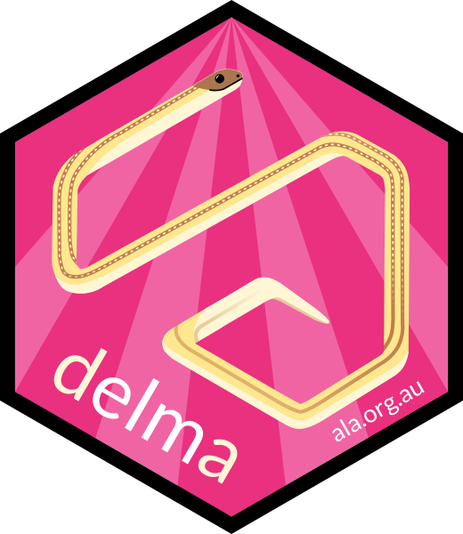

<!-- README.md is generated from README.Rmd. Please edit that file -->

```{r, echo = FALSE}
knitr::opts_chunk$set(
  collapse = TRUE,
  comment = "#>"
)
```

# delma <br>

## Overview

`delma` is a package for converting metadata statements written in markdown,
RMarkdown or Quarto markdown to [Ecological Metadata Language](https://eml.ecoinformatics.org) (EML). It is named
for a genus of legless lizards that are endemic to Australia, whose name happens
to contain the letters 'e', 'm' and 'l'.

The logo depicts a striped legless lizard (_Delma impar_) in the 
style of the classic mobile game 'snake', a play on the observation that
_Delma_ are often mistaken for snakes. It was drawn by [Martin Westgate](https://martinwestgate.com).

If you have any comments, questions or suggestions, please [contact us](mailto:support@ala.org.au).
 
## Installation
This package is under active development, and is not yet available on CRAN. You
can install the latest development version from GitHub with:

```{r, eval = FALSE}
install.packages("remotes")
remotes::install_github("AtlasOfLivingAustralia/delma")
```

Load the package:

```{r, eval=FALSE}
library(delma)
```

```{r, include = FALSE}
devtools::load_all()
library(dplyr)
```

## Basic usage

The primary use case for `delma` is to build metadata statements for sharing 
biodiversity data. The first step is to create a markdown file, and add any 
headings that you like that conform to the EML standard. The header 'level' 
(i.e. number of `#`) is used to designate the degree of nesting. If you don't 
want to start from scratch, you can use the example statement provided:

```{r, eval=FALSE}
use_metadata("my_metadata_statement.Rmd")
```

This document can be knit like any other Rmarkdown document, using either the 
'knit' button in RStudio, or the function `rmarkdown::knit()`. In both cases it 
will render to the format defined in the yaml section, which defaults to 
`html_document`, but can easily be changed. To convert this document to EML,
use:

```{r, eval=FALSE}
render_metadata("my_metadata_statement.Rmd", 
                "metadata.xml")
```

Note that EML documents use the extension `.xml`. To check that your document
is formatted in accordance with the EML standard, use:

```{r, eval=FALSE}
check_metadata("metadata.xml")
```


For a more detailed description of delma's capabilities and methods, see the 
'Quick start guide' vignette.

## Citing `delma`
To generate a citation for the package version you are using, you can run:

```{r}
citation(package = "delma")
```

The current recommended citation is:

> Westgate MJ, Balasubramaniam S & Kellie D (2025) Convert Rmarkdown and Quarto Documents to Ecological Metadata Language. R Package version 0.1.0.
